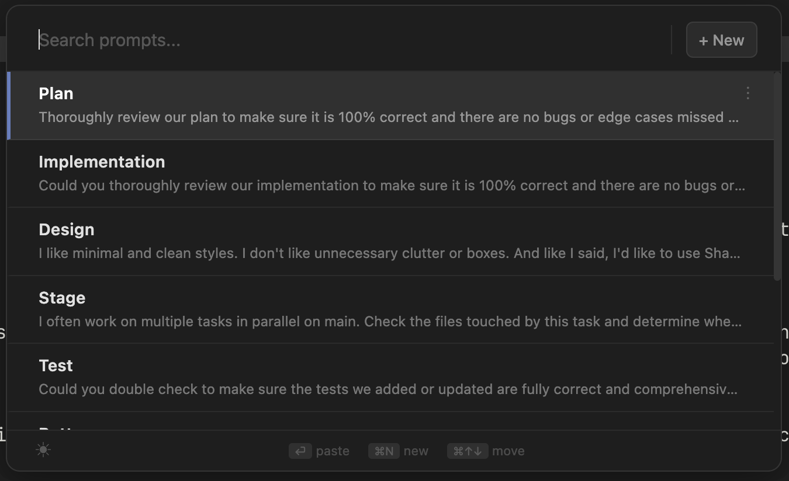

# Promptly

A quick-access prompt manager for macOS. Press `Cmd+Shift+Space` from anywhere, pick a prompt, and it pastes into the app you were just using.



## How it works

Promptly runs in the background as a dock-less utility. The global shortcut summons a floating search window that stays above other windows (including fullscreen apps). Selecting a prompt copies it to the clipboard, refocuses the previously active app, and simulates `Cmd+V`.

Prompts are stored locally in SQLite under the Electron `userData` directory. Nothing leaves your machine.

## Requirements

- macOS (Intel or Apple Silicon)
- Node.js (see `.nvmrc`)
- Xcode Command Line Tools (for building the native paste module)

## Setup

```sh
npm install
npm run rebuild   # build the native module against the bundled Electron
npm start
```

On first launch, macOS will prompt for **Accessibility** permission. This is required so Promptly can simulate the paste keystroke into other apps. Grant it in System Settings → Privacy & Security → Accessibility, then restart the app.

## Usage

- `Cmd+Shift+Space` — open Promptly
- Type to filter prompts
- `Enter` — paste the highlighted prompt into the previous app
- `Esc` — dismiss
- Drag prompts in the list to reorder

The app launches at login by default.

## Building a distributable

```sh
npm run dist
```

Produces a universal `.dmg` under `dist/`.

## Project layout

- `main.js` — Electron main process, global shortcut, IPC handlers
- `preload.js` — context bridge exposing the `promptly` API to the renderer
- `index.html` — renderer UI (search, list, editor)
- `db.js` — SQLite persistence via `better-sqlite3`
- `native/paste.mm` — Objective-C++ N-API addon for `Cmd+V` simulation and app activation
- `binding.gyp` — native build config

## License

ISC
